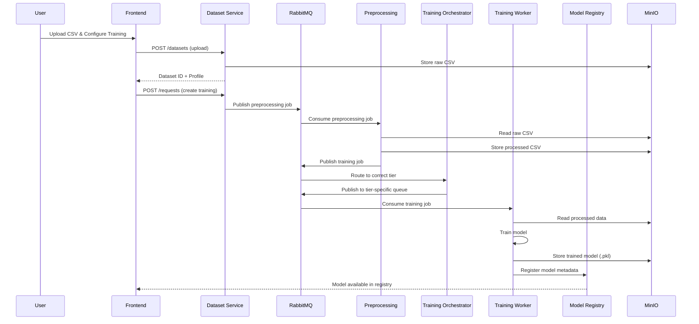

<p align="center">
  
</p>

<h1 align="center">⚡ Catalyst — MLaaS Platform</h1>

<p align="center">
  <b>Machine Learning as a Service</b><br/>
  Upload your data, choose your model, and let our platform handle the rest.
</p>

<p align="center">
  
  
  
  
  
  
</p>

---

## 📖 Overview

**Catalyst** is a full-stack Machine Learning as a Service (MLaaS) platform built on a microservices architecture. It empowers users to train ML models without writing a single line of code — simply upload a dataset, configure preprocessing, select a model, and submit. The platform handles data preprocessing, model training, and result storage asynchronously through a distributed pipeline.

### Key Highlights

- 🚀 **End-to-end ML Pipeline** — From raw CSV to trained model in a few clicks
- 🤖 **AI-Powered Recommendations** — Get intelligent model & preprocessing suggestions via LLM-driven analysis
- 📊 **Rich Analytics Dashboard** — Real-time stats, charts, and training trend visualizations
- 💰 **Credit-Based Usage System** — Tiered model pricing with balance tracking and transaction history
- 🔐 **Secure Authentication** — JWT-based auth with password recovery flows
- 🐳 **Fully Dockerized** — One-command deployment with Docker Compose
- 🌙 **Dark Mode** — Sleek, modern UI with light and dark theme support

---

## 🏗️ Architecture

Catalyst follows a **microservices architecture** with event-driven communication via RabbitMQ.

```
┌─────────────────────────────────────────────────────────────────┐
│                        Frontend (React + Vite)                  │
│                     Port 5173 — Dashboard UI                    │
└──────────┬──────────┬──────────┬──────────┬──────────┬──────────┘
           │          │          │          │          │
     ┌─────▼───┐ ┌────▼────┐ ┌──▼───┐ ┌───▼────┐ ┌───▼────┐
     │  User   │ │ Dataset │ │Model │ │Credit  │ │Recomm. │
     │ Service │ │ Service │ │Regis.│ │Service │ │Service │
     │ :8000   │ │ :8001   │ │:8003 │ │:8004   │ │:8002   │
     └─────────┘ └────┬────┘ └──────┘ └────────┘ └────────┘
                       │
                       ▼
              ┌──────────────┐
              │  RabbitMQ    │
              │  :5672       │
              └──────┬───────┘
                     │
        ┌────────────┼────────────┐
        ▼            ▼            ▼
  ┌───────────┐┌───────────┐┌───────────┐
  │Preprocess ││ Training  ││ Training  │
  │  Service  ││Orchestrat.││ Workers   │
  └─────┬─────┘└───────────┘└─────┬─────┘
        │                         │
        └──────────┬──────────────┘
                   ▼
            ┌────────────┐
            │   MinIO    │
            │ :9000/9001 │
            └────────────┘
```

### Services

| Service | Port | Description |
|---------|------|-------------|
| **Frontend** | `5173` | React 19 + Vite SPA with Tailwind CSS |
| **User Service** | `8000` | Authentication, registration, JWT token management |
| **Dataset Service** | `8001` | CSV upload, dataset profiling, training request management |
| **Recommendation Service** | `8002` | AI-powered model & preprocessing recommendations |
| **Model Registry Service** | `8003` | Trained model storage, metadata, and retrieval |
| **Credit Service** | `8004` | Credit balance management and transaction history |
| **Training Orchestrator** | — | RabbitMQ consumer that routes training jobs to the appropriate tier |
| **Preprocessing Service** | — | RabbitMQ consumer for data cleaning, encoding, scaling, and feature selection |
| **Low Training Service** | — | Trains low-complexity models (Logistic/Linear Regression, K-Means) |
| **Medium Training Service** | — | Trains medium-complexity models (Random Forest, XGBoost) |
| **High Training Service** | — | Trains high-complexity models (SVM, SVR, DBSCAN) |
| **RabbitMQ** | `5672` / `15672` | Message broker for async job distribution |
| **MinIO** | `9000` / `9001` | S3-compatible object storage for datasets and trained models |

---

## 🧠 Supported Models

Models are organized into three cost tiers:

| Tier | Credits | Models |
|------|---------|--------|
| 🟢 **Low** | 5 | Logistic Regression, Linear Regression, K-Means |
| 🟡 **Medium** | 10–15 | Random Forest (Classifier/Regressor), XGBoost (Classifier/Regressor) |
| 🔴 **High** | 20 | SVM Classifier, SVR, DBSCAN |

### Learning Types
- **Supervised** — Classification & Regression with target column selection
- **Unsupervised** — Clustering without a target variable

### Preprocessing Options
- **Missing Values** — None, Mean, Median, Mode, Drop
- **Encoding** — None, Label Encoding, One-Hot Encoding
- **Feature Selection** — None, Correlation, Variance Threshold
- **Scaling** — None, StandardScaler, MinMaxScaler
- **PCA** — Optional dimensionality reduction

---

## 🚀 Getting Started

### Prerequisites

- [Docker](https://docs.docker.com/get-docker/) & [Docker Compose](https://docs.docker.com/compose/install/)
- Git

### 1. Clone the Repository

```bash
git clone https://github.com/Hamshith/Catalyst---MLaaS-Platform.git
cd Catalyst---MLaaS-Platform
```

### 2. Configure Environment Variables

Each service requires a `.env` file. Create them based on the following templates:

<details>
<summary><b>services/user-service/.env</b></summary>

```env
MONGO_URI=mongodb+srv://<username>:<password>@<cluster>.mongodb.net/
JWT_SECRET_KEY=your_jwt_secret_key
JWT_ALGORITHM=HS256
JWT_ACCESS_TOKEN_EXPIRE_MINUTES=60
JWT_REFRESH_TOKEN_EXPIRE_DAYS=30
MONGODB_DATABASE=ml_platform

# CORS
CORS_ORIGINS=http://localhost:5173

# Email (for password recovery)
SMTP_HOST=smtp.gmail.com
SMTP_PORT=587
SMTP_USERNAME=your_email@gmail.com
SMTP_PASSWORD=your_app_password
```
</details>

<details>
<summary><b>services/dataset-service/.env</b></summary>

```env
MONGO_URI=mongodb+srv://<username>:<password>@<cluster>.mongodb.net/
MONGODB_DATABASE=ml_platform

# RabbitMQ
RABBITMQ_HOST=rabbitmq
RABBITMQ_PORT=5672

# MinIO
MINIO_ENDPOINT=minio:9000
MINIO_ACCESS_KEY=minioadmin
MINIO_SECRET_KEY=minioadmin

# JWT
JWT_SECRET_KEY=your_jwt_secret_key
JWT_ALGORITHM=HS256

# CORS
CORS_ORIGINS=http://localhost:5173
```
</details>

<details>
<summary><b>services/recommendation-service/.env</b></summary>

```env
MONGO_URI=mongodb+srv://<username>:<password>@<cluster>.mongodb.net/
MONGODB_DATABASE=ml_platform
GEMINI_API_KEY=your_gemini_api_key

JWT_SECRET_KEY=your_jwt_secret_key
JWT_ALGORITHM=HS256

# CORS
CORS_ORIGINS=http://localhost:5173
```
</details>

<details>
<summary><b>services/credit-service/.env</b></summary>

```env
# MongoDB
MONGODB_URI=mongodb+srv://<username>:<password>@<cluster>.mongodb.net/
MONGODB_DATABASE=ml_platform

JWT_SECRET_KEY=your_jwt_secret_key
JWT_ALGORITHM=HS256

CORS_ORIGINS=http://localhost:5173
```
</details>

<details>
<summary><b>services/model-registery-service/.env</b></summary>

```env
# MinIO
MINIO_ENDPOINT=minio:9000
MINIO_ACCESS_KEY=minioadmin
MINIO_SECRET_KEY=minioadmin
MINIO_MODEL_BUCKET=ml-models
MINIO_SECURE=False

# MongoDB
MONGODB_URI=mongodb+srv://<username>:<password>@<cluster>.mongodb.net/
MONGODB_DATABASE=ml_platform

JWT_SECRET_KEY=your_jwt_secret_key
JWT_ALGORITHM=HS256

# CORS
CORS_ORIGINS=http://localhost:5173
```
</details>

<details>
<summary><b>services/training-orchestrator/.env</b></summary>

```env
RABBITMQ_HOST=rabbitmq
RABBITMQ_PORT=5672

TRAINING_QUEUE=training_queue

LOW_TRAINING_QUEUE=low_training_queue
MEDIUM_TRAINING_QUEUE=medium_training_queue
HIGH_TRAINING_QUEUE=high_training_queue
```
</details>

<details>
<summary><b>services/preprocessing-service/.env</b></summary>

```env
MONGO_URI=mongodb+srv://<username>:<password>@<cluster>.mongodb.net/
MONGODB_DATABASE=ml_platform

RABBITMQ_HOST=rabbitmq
RABBITMQ_PORT=5672

MINIO_ENDPOINT=minio:9000
MINIO_ACCESS_KEY=minioadmin
MINIO_SECRET_KEY=minioadmin

REQUEST_QUEUE=preprocessing_queue
TRAINING_QUEUE=training_queue
```
</details>

<details>
<summary><b>services/low-model-training-service/.env</b></summary>

```env
# RabbitMQ
RABBITMQ_HOST=rabbitmq
RABBITMQ_PORT=5672

LOW_TRAINING_QUEUE=low_training_queue

# MinIO
MINIO_ENDPOINT=minio:9000
MINIO_ACCESS_KEY=minioadmin
MINIO_SECRET_KEY=minioadmin
MINIO_DATASET_BUCKET=datasets
MINIO_MODEL_BUCKET=ml-models
MINIO_SECURE=False

# MongoDB
MONGODB_URI=mongodb+srv://<username>:<password>@<cluster>.mongodb.net/
MONGODB_DATABASE=ml_platform
```
</details>

<details>
<summary><b>services/medium-model-training-service/.env</b></summary>

```env
# RabbitMQ
RABBITMQ_HOST=rabbitmq
RABBITMQ_PORT=5672

MEDIUM_TRAINING_QUEUE=medium_training_queue

# MinIO
MINIO_ENDPOINT=minio:9000
MINIO_ACCESS_KEY=minioadmin
MINIO_SECRET_KEY=minioadmin
MINIO_DATASET_BUCKET=datasets
MINIO_MODEL_BUCKET=ml-models
MINIO_SECURE=False

# MongoDB
MONGODB_URI=mongodb+srv://<username>:<password>@<cluster>.mongodb.net/
MONGODB_DATABASE=ml_platform
```
</details>

<details>
<summary><b>services/high-model-training-service/.env</b></summary>

```env
# RabbitMQ
RABBITMQ_HOST=rabbitmq
RABBITMQ_PORT=5672

HIGH_TRAINING_QUEUE=high_training_queue

# MinIO
MINIO_ENDPOINT=minio:9000
MINIO_ACCESS_KEY=minioadmin
MINIO_SECRET_KEY=minioadmin
MINIO_DATASET_BUCKET=datasets
MINIO_MODEL_BUCKET=ml-models
MINIO_SECURE=False

# MongoDB
MONGODB_URI=mongodb+srv://<username>:<password>@<cluster>.mongodb.net/
MONGODB_DATABASE=ml_platform
```
</details>

<details>
<summary><b>frontend/.env</b></summary>

```env
VITE_USER_SERVICE_URL=http://localhost:8000
VITE_DATASET_SERVICE_URL=http://localhost:8001
VITE_RECOMMENDATION_SERVICE_URL=http://localhost:8002
VITE_MODEL_SERVICE_URL=http://localhost:8003
VITE_CREDIT_SERVICE_URL=http://localhost:8004
```
</details>

### 3. Launch with Docker Compose

```bash
docker compose up -d
```

This will spin up all 14 containers (10 services + frontend + RabbitMQ + MinIO + MinIO init). The MinIO init container automatically creates the required `datasets` and `ml-models` buckets.

### 4. Access the Application

| Interface | URL |
|-----------|-----|
| **Catalyst App** | [http://localhost:5173](http://localhost:5173) |
| **RabbitMQ Dashboard** | [http://localhost:15672](http://localhost:15672) (guest/guest) |
| **MinIO Console** | [http://localhost:9001](http://localhost:9001) (minioadmin/minioadmin) |

---

## 🔄 How It Works



---

## 📂 Project Structure

```
Catalyst---MLaaS-Platform/
├── docker-compose.yml              # Full-stack orchestration
├── frontend/                       # React 19 + Vite + Tailwind CSS
│   ├── src/
│   │   ├── api/                    # Axios clients for each service
│   │   ├── components/             # Reusable UI (cards, charts, tables)
│   │   ├── constants/              # Model options, display names
│   │   ├── features/auth/          # Auth context & hooks
│   │   ├── hooks/                  # Custom React hooks
│   │   ├── layouts/                # Dashboard & Auth layouts
│   │   ├── pages/                  # Route pages
│   │   ├── routes/                 # Protected route wrapper
│   │   └── utils/                  # Helpers (date formatting, etc.)
│   └── Dockerfile
├── services/
│   ├── user-service/               # FastAPI — Auth & user management
│   ├── dataset-service/            # FastAPI — Dataset upload & profiling
│   ├── recommendation-service/     # FastAPI — AI-powered recommendations
│   ├── model-registery-service/    # FastAPI — Trained model registry
│   ├── credit-service/             # FastAPI — Credit system
│   ├── training-orchestrator/      # Python — RabbitMQ job router
│   ├── preprocessing-service/      # Python — Data preprocessing pipeline
│   ├── low-model-training-service/ # Python — Low-tier model training
│   ├── medium-model-training-service/ # Python — Mid-tier model training
│   └── high-model-training-service/   # Python — High-tier model training
└── .gitignore
```

---

## 🛠️ Tech Stack

### Frontend
| Technology | Purpose |
|------------|---------|
| React 19 | UI framework |
| Vite 8 | Build tool & dev server |
| Tailwind CSS 4 | Utility-first styling |
| React Router 7 | Client-side routing |
| TanStack React Query | Server state management & caching |
| React Hook Form + Zod | Form management & validation |
| Recharts | Data visualization (charts) |
| Lucide React | Icon library |
| Axios | HTTP client |

### Backend
| Technology | Purpose |
|------------|---------|
| FastAPI | REST API framework (Python) |
| MongoDB | Primary database |
| RabbitMQ | Async message broker |
| MinIO | S3-compatible object storage |
| scikit-learn | ML model training |
| XGBoost | Gradient boosting models |
| Pandas | Data manipulation & profiling |
| JWT (PyJWT) | Authentication tokens |

### Infrastructure
| Technology | Purpose |
|------------|---------|
| Docker | Containerization |
| Docker Compose | Multi-container orchestration |

---

## 🖥️ Application Pages

| Page | Route | Description |
|------|-------|-------------|
| **Login** | `/login` | User authentication |
| **Register** | `/register` | New account creation |
| **Forgot Password** | `/forgot-password` | Password recovery flow |
| **Dashboard** | `/` | Overview stats, charts, recent requests |
| **Create Training** | `/training/new` | 5-step wizard: Upload → Overview → Configure → Model → Review |
| **Requests** | `/requests` | List of all training requests with status |
| **Request Detail** | `/requests/:id` | Detailed view of a specific training job |
| **Credits** | `/credits` | Credit balance, cost table, transaction history |
| **Change Password** | `/change-password` | Update account password |

---

## 📜 License

This project is for educational and demonstration purposes.

---

<p align="center">
  <b>Catalyst</b> — Build. Train. Predict. ⚡
</p>
